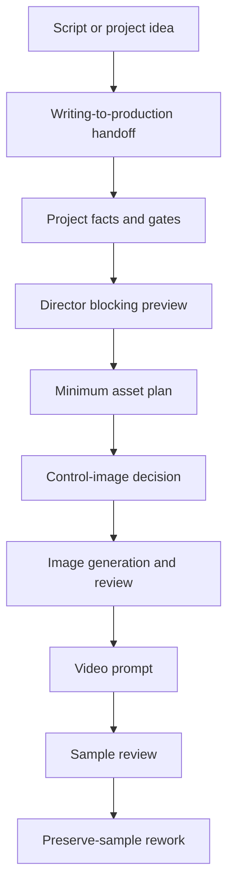

# AI Manga Director

AI Manga Director is a universal agent workflow pack for turning scripts into gated AI manga, comic drama, and cinematic short-video production workflows.

It is not a prompt dump and it is not tied to one AI app. It is a production system that can be used with Custom GPTs, Claude-style Skills, Codex Skills, Gemini/Grok-style agents, local agent frameworks, or any assistant that can read Markdown instructions.


## Why This Is Different

Most AI video workflows fail because they jump from story directly to a long prompt. This skill adds the missing production layer:

- **Project gates before generation**: do not make keyframes or video prompts before main characters, required scenes, props, and dialogue are checked.
- **Director blocking before prompting**: define staging, camera, action, focus, transitions, sound bridge, and ending state before writing model text.
- **Minimum necessary assets**: decide what images are actually needed instead of blindly producing every possible reference.
- **Seedance-style all-reference logic**: explain what each uploaded image controls and what it must not control.
- **Control-image decision system**: decide when to use storyboards, spatial maps, action paths, camera guides, effect-zone maps, start/end frames, or no control image.
- **Character reference standard**: default main-character board uses a strict 9:16 unequal 2x2 professional layout, not random multi-view collages.
- **Image refinement modes**: choose no-op, local repair, HD redraw, cinematic realism, style-preserving refinement, or video-model reference optimization.
- **Dialogue and sound as production design**: original dialogue, voice consistency, ambience, Foley, and no-background-music raw generation rules are checked before video prompts.
- **Preserve-sample rework**: when a video sample is close, fix only the highest-risk issue instead of rewriting the whole shot.

## Who It Is For

- AI manga and AI comic creators
- cinematic AI short-video creators
- serialized story teams using image-to-video tools
- creators using Seedance-style multi-reference workflows
- anyone who needs a repeatable script-to-video production pipeline

## Repository Layout

```text
UNIVERSAL_AGENT_PROMPT.md

skills/ai-manga-director/
  SKILL.md
  agents/openai.yaml
  references/
    workflow-gates.md
    asset-and-control-images.md
    character-reference.md
    director-blocking.md
    video-prompts.md
    image-refinement.md
    sound-dialogue.md
    scriptwriting.md
    review-rework.md

docs/
  index.md
  workflow.md
```

## Use With Any Agent

Upload or paste these files into your agent's knowledge / project / instruction system:

1. `skills/ai-manga-director/SKILL.md`
2. every file in `skills/ai-manga-director/references/`
3. optionally `UNIVERSAL_AGENT_PROMPT.md` as the startup instruction

Then start with:

```text
Use AI Manga Director in compact mode. First identify my task type, current gate, missing required assets, and the next allowed action. Do not write a final video prompt until gates pass.
```

## Optional Codex Installation

For Codex, copy the skill folder into the local skills directory:

```powershell
Copy-Item -Recurse .\skills\ai-manga-director $env:USERPROFILE\.codex\skills\
```

Then start a new chat and ask:

```text
Use $ai-manga-director to turn this script into a gated AI manga production workflow.
```

## Quick Use

### Start From A Script

```text
Use AI Manga Director. I have a 10-minute fantasy short script. First run writing-to-production handoff, then list the minimum assets needed before image generation.
```

### Continue A Project

```text
Use AI Manga Director. Continue this project from the current approved assets. Keep the answer short: status, gate, missing assets, next action.
```

### Build A Video Prompt

```text
Use AI Manga Director. Generate a Seedance-style 15-second image-to-video prompt. First check reference responsibilities, original dialogue, timing feasibility, and sound rules.
```

### Review A Generated Video

```text
Use AI Manga Director. Review this sample and suggest the smallest rework that preserves the current shot.
```

## Learn By Example

- [Quickstart](docs/quickstart.md)
- [Mini project example](examples/mini-project/)
- [Chinese README](README.zh-CN.md)
- [Changelog](CHANGELOG.md)

## Example Workflow



## Public Package Boundary

This repository is a generic workflow package. It does not include private project facts, local paths, proprietary character bibles, or episode-specific continuity ledgers.

For each real project, provide your own script, project facts, approved assets, and continuity state.
